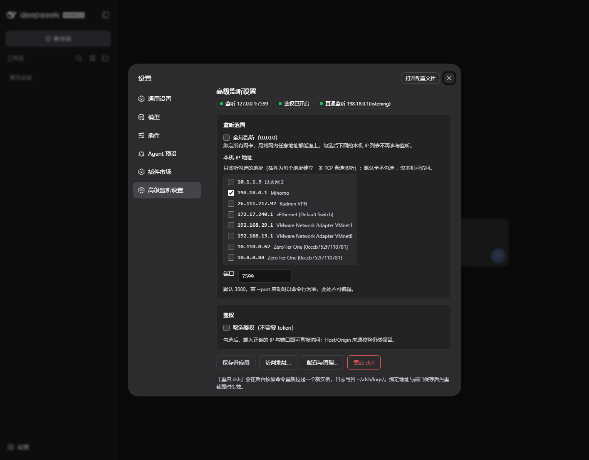
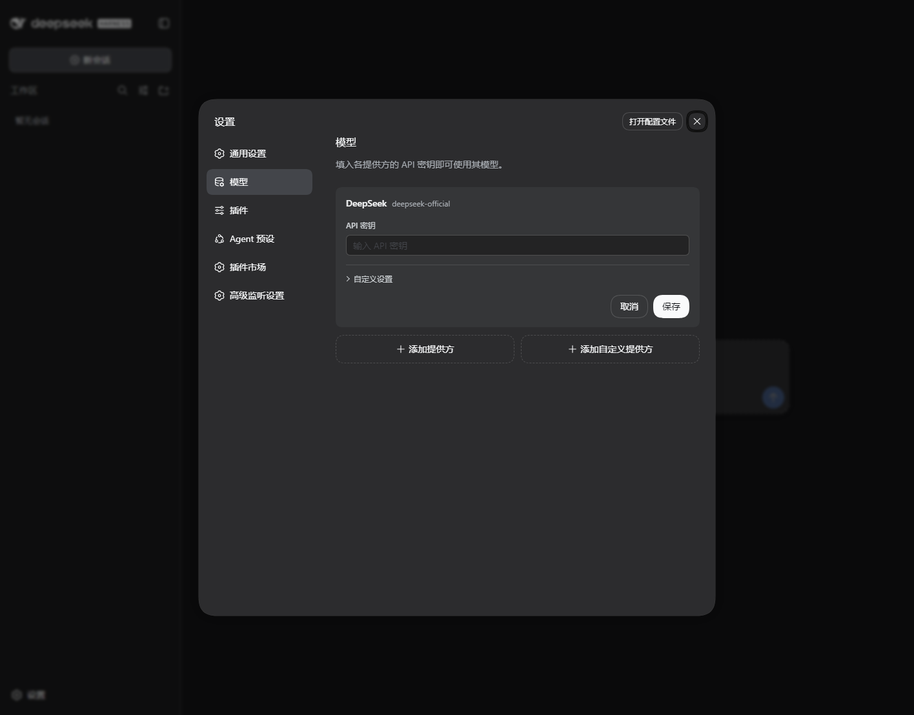

# dsh-advanced-listening-settings

[](https://dsh-plugin.org/plugins/jcjyids/dsh-web-advanced-settings)

给 DSH Web GUI 的「设置」加一个独立分区 **高级监听设置**：把 Web 服务暴露到局域网，按网卡 IP 精确控制暴露范围，并把远程访问下会失效的两处宿主限制补齐。

- 安装：`dsh plugin --profile web add dsh-advanced-listening-settings`
- 支持的 profile：`web`
- 兼容：dsh `0.1.5-rc.3`；Node ≥ 22.6
- 卸载：**默认态零残留**，卸载前可一键完全清理

插件本体是一个标准的 DSH bundle 插件（`dsh.bundle.patch` + `dsh.client`）：宿主半边 `index.js`、浏览器半边 `client.js`、bundle 补丁 `cordis.patch.yml`。

## 特性

| 控件 | 作用 | 生效方式 |
| --- | --- | --- |
| **全局监听（0.0.0.0）** | 绑定所有网卡 | 写入组合层 → 热重载重新绑定 |
| **本机 IP 列表 + 复选框** | 只监听勾选的网卡地址（默认全不选 = 仅本机） | 运行时立即生效 |
| **端口** | 对外服务端口，默认 3080；命令行 `--port` 优先（此时输入框置灰并显示实际端口） | 写入组合层 → 热重载重新绑定 |
| **取消鉴权** | 去掉 token（401）校验，直接访问 `IP:端口` 即可；Host/Origin 来源校验（403）保留 | 运行时立即生效 |
| **重启 dsh**（二次确认） | 按原命令在后台拉起新实例 | 立即 |
| **访问地址…**（二级页） | 列出全部可用入口 URL，一键复制；免鉴权时列不带 token 的地址 | — |
| **配置与清理…**（二级页） | 查看托管块与文件位置、检测并清理历史遗留条目、移除托管块、完全清理（卸载前） | — |

## 界面预览



手机或另一台电脑从局域网地址打开同一实例时，设置页里的模型与凭据不再报「settings are unavailable」，插件市场的系统诊断也能真正跑完（见「远程访问」）：



## 安装

```powershell
# 从 npm
dsh plugin --profile web add dsh-advanced-listening-settings

# 或从本地目录 / tarball
dsh plugin --profile web add "C:\path\to\dsh-advanced-listening-settings"
dsh plugin --profile web add .\dsh-advanced-listening-settings-1.0.1.tgz
```

然后重启一次 dsh（面板里的「重启 dsh」按钮，或手动重启）。重启后：**设置 → 高级监听设置**。

> 本地目录安装建的是 `link:` 依赖，目录必须留在原位；从 npm 安装则没有这个约束。

## 卸载与清理

插件刻意做到**默认态零残留**：没有配置过时不写任何文件；配置过的东西也能一键收回。

```powershell
# 1) 先在面板「配置与清理… → 完全清理（卸载前）」点一下
#    它会删掉插件写下的一切：托管块、遗留条目、设置文件
# 2) 再卸载
dsh plugin --profile web remove dsh-advanced-listening-settings
# 3) 重启 dsh
```

忘了第 1 步也没关系——卸载之后插件虽然不在本地，清理命令依然能跑（从 npm 现场取一份）：

```powershell
npx -y dsh-advanced-listening-settings cleanup --dry-run   # 先看会删什么
npx -y dsh-advanced-listening-settings cleanup             # 真删
npx -y dsh-advanced-listening-settings cleanup --profile web --home "$env:USERPROFILE\.dsh"
```

`pnpm remove` 会自己清掉 profile 的 `package.json` 依赖、`dsh.profile.bundles` 条目、`node_modules` 链接与 `pnpm-lock.yaml` 条目；**但它不会跑插件的代码**，所以插件写在 profile 里的状态文件与组合层托管块，要靠上面这两条路收回。

**启动失败时的急救**：插件已对初始化异常做了兜底（失败只跳过自己，不影响宿主），仍可用 `remove` 摘掉它；若连启动都不行，直接手工删掉 `cordis.patch.yml` 里 `>>> dsh-advanced-listening-settings` 与 `<<< dsh-advanced-listening-settings` 之间那一段即可。

## 远程访问

把接口暴露到局域网只是第一步。DSH 的宿主与部分插件把「页面是不是回环来源」当作特权判据，远程页面天然不满足，于是出现两个只在远程访问时才犯的毛病：

| 现象 | 根因（已对源码定位） | 本插件的修复 |
| --- | --- | --- |
| 设置 → 模型 显示 **加载提供方目录失败: settings are unavailable in this browser** | `dsh-client-ui-settings` 用 `ctx.remote.$host.isLoopback ? 'host' : 'memory'` 决定设置文档持久化；`isLoopback` 由 `location.hostname` 推导，局域网 IP 不是回环 → 降级 `memory` → 设置镜像永远为空 | index 头部注入一次 `globalThis.__DSH_TRANSPORT__ = { ownsHost: true }`（仅在宿主未提供 transport 时），让远程页面按宿主面处理；客户端再对 `connection.isLoopback` 做一次可逆断言兜底 |
| 插件市场 → 系统诊断 里 npm / github / 目录站 **不等超时、瞬间「不可达」** | `dsh-plugin` 的 `isSameOrigin()` 要求 `Origin` 主机名 ∈ {localhost, 127.0.0.1, [::1]}，局域网 Origin 直接 403 `untrusted origin`，探测根本没跑 | 在 `http.Server` 的 `request`/`upgrade` 前置一层规范化：把 Host 是本机局域网 IP 的请求改写回 `127.0.0.1:<port>`（连带 Origin / Referer / Sec-Fetch-Site） |

安全边界：**只改写 Host 恰好是本机某个非回环 IPv4 的请求**。DNS rebinding 的攻击页面带的是攻击者域名，不会被改写，来源围栏照常 403；`evil.example` 这类未信任 Host 在测试中依旧被拒。

> 做法对齐社区成熟实现 [dsh-pocket](https://github.com/shaobeichen/dsh-pocket)：它在反向代理里把 Host/Origin 统一改写成回环权威，并在客户端插件里断言 `connection.isLoopback`；本插件把同一件事直接挂在 `http.Server` 上，因此 **`0.0.0.0` 与「指定 IP 直通」两种模式都覆盖**，不需要额外代理进程。

自检接口：`GET /advanced-listening/whoami` 会回显宿主实际看到的权威与来源头，用来确认入口改写是否生效。

## 权限与安全

**它会动什么**

- 读当前 profile 目录（`~/.dsh/profiles/<profile>/`）：写设置文件、改 `cordis.patch.yml` 的托管块（改前备份 `.bak`，写入走临时文件 + rename）。
- 覆写运行中 `HostConnectionService` 的两个实例方法（`requestRejection` / `authorizeIndex`）以实现「取消鉴权」；停用 / 卸载时自动还原，且只还原属于自己的那一层。
- 在 `webServer` 上注册 `/advanced-listening/*` 路由，并在 http 服务器前挂一层入口头规范化（**只对本机局域网 IPv4 的 Host 生效**）。
- 为勾选的网卡地址建立 TCP 直通监听（`net` 原样双向转发到 `127.0.0.1:<端口>`）。
- 点「重启 dsh」时按原命令行在后台拉起新实例（等价于你自己重启一次 dsh）。
- **不写官方安装目录、不改官方源码、不采集任何数据。**

**外部服务**：无。除你自己打开的设置页之外不发起任何外部请求；`bin/cleanup.mjs` 与测试套件也不联网（`npx -y dsh-advanced-listening-settings cleanup` 只从 npm 取一次包）。

**安全须知**

- **取消鉴权 + 局域网暴露 = 任何能访问该地址的人都能操控你的 DSH**（执行命令、读写工作区文件）。面板上有红色警示。
- 免鉴权只去掉 token（401）校验，**Host/Origin 围栏（403）仍在**：`/` 与 `/api` 都会拦未信任 Host、跨站 `Origin`、`Sec-Fetch-Site: cross-site`；入口改写只针对「Host 是本机局域网 IP」的请求，不对外部域名放行。
- 经过入口改写后，远程页面在宿主看来与回环页面同类（这也是「设置 / 市场诊断可用」的原因）。**因此鉴权是远程访问唯一的门**：请保留 token 鉴权，或只在完全可信的网络里关闭它。
- 只监听勾选的地址本身就是最小暴露面；不勾任何 IP 时等同默认（仅回环）。
- Windows 首次绑定非回环地址时系统防火墙可能弹窗；这是操作系统行为，不是插件行为。

**兼容性**：dsh `0.1.5-rc.3`（已对源码核对）；profile `web`；Node ≥ 22.6；Windows / macOS / Linux（重启器在 Windows 用 `netstat` + `taskkill`，POSIX 用 `lsof` + `SIGTERM`）；仅 IPv4 网卡。DSH 处于开发者预览期，升级 dsh 后建议重跑 `npm test` 并确认面板仍能打开。

## 数据与文件

| 文件 | 什么时候存在 | 内容 |
| --- | --- | --- |
| `~/.dsh/profiles/web/advanced-listening-settings.json` | 只在偏离出厂默认时（非默认端口 / 全局监听 / 勾了 IP / 关了鉴权）；回到默认自动删除 | 期望状态（模式 / IP 列表 / 端口 / 是否免鉴权），唯一真源 |
| `~/.dsh/profiles/web/cordis.patch.yml` 的托管块 | 只在组合层默认值不够用时（`0.0.0.0` 或非默认端口）；不需要时自动撤掉 | `webserver` 的 `host` / `port`；写入前备份 `.bak`，写入走临时文件 + rename |
| `~/.dsh/logs/dsh-web-<端口>.log` | 只有点过「重启 dsh」才有 | 重启后新实例的日志 |

插件不在 profile 之外写任何文件：重启器用 `node -e` 内联执行（两段式，源码经环境变量传给第二段），不落盘。

profile 目录优先从插件 entry 的 `ctx.baseUrl` 推断（即当前真正运行的 profile），扫描 `profiles/*/package.json` 只作兜底——避免多个 profile 都装了插件时写错文件。

## 实现说明

三条技术事实决定了实现形态（均已对 dsh 0.1.5-rc.3 源码核对）：

1. **webserver 的绑定地址是硬编码的二选一**（`Config.host` 只接受 `127.0.0.1` / `0.0.0.0`），Node 也只支持一个监听地址。所以「只监听某几个网卡 IP」由本插件自己实现：webserver 保持 `127.0.0.1`，插件为每个勾选地址建一条 **TCP 直通监听**（`net` 原样双向转发到 `127.0.0.1:端口`）。因为不解析 HTTP，普通请求、SSE、WebSocket（`/api` 与 HMR）、gzip 全部透明可用；未勾选的地址**连接直接被拒**。
2. **host/port 是组合层（`cordis.patch.yml`）的配置**，只有 Loader 启动时读得到，所以绑定类改动必须落盘。web profile 模板的 `patchReload` 是 `live`：写入后只会重启配置真正变化的行，webserver 重新绑定后各插件的路由会自动重挂。托管块保留命令行优先级：`port: !!js ctx.webStartup.port ?? <保存值>`，`dsh web --port 9000` 依旧赢。
   > 组合层补丁是**整段替换**目标行的 `config`，所以托管块必须复述 webserver 行的全部 5 个键（`host` / `port` / `compression` / `compressionLevel` / `compressionThresholdBytes`）。`test/patch-rewrite.test.mjs` 会守住这条契约。
3. **鉴权是 `HostConnectionService` 上的两个公开方法**（`requestRejection` 返回 `403`/`401`，`authorizeIndex` 负责 index 的 token/Cookie 交换）。插件在实例上做可逆覆写：只摘掉 401 那一层；`authorizeIndex` 的覆写仍然先调用基函数，把 403 围栏原样保留（否则 DNS rebinding 的 Host 也能拿到 index.html）。插件停止或卸载时自动还原，且只还原「仍属于自己的那一层」。

## 开发与测试

```powershell
# 离线单元测试（无需启动 dsh）
node test/patch-rewrite.test.mjs      # 组合文件改写、默认态零残留判定、遗留条目识别、CRLF 行偏移
node test/ingress-normalize.test.mjs  # 入口头改写：dsh-plugin isSameOrigin 与来源围栏的回归点
node test/client-bundle.test.mjs      # 客户端 bundle：注册 id = 包名、isLoopback 断言与还原、settings.section 契约
node test/cleanup-cli.test.mjs        # bin/cleanup.mjs：dry-run / 真清 / 幂等 / 不误删他人文件
node test/restart-helper.test.mjs     # 内联重启器：argv 约定、零文件、两段式真实交接
node test/kill-port.mjs 3098          # 辅助：按端口清理遗留实例

npm test                              # 上面 5 套一起跑
npm run test:e2e                      # 隔离 profile 端到端（高位端口跑真实 dsh，绝不碰 3080 实例）
```

`e2e-isolated.mjs` 会在 `test/.tmp/` 下造一个临时 `DSH_HOME` 与 web profile（base + web-app + 本插件），逐项验证：默认回环 + 鉴权、指定 IP 直通、全局监听、免鉴权与 403 围栏、局域网入口改写与市场 POST 判定、改端口热重载、重启后设置保持、完全清理后回到出厂态、不产生 profile 之外的文件。

`restart-helper.test.mjs` 与 `e2e-isolated.mjs` 需要调用 `netstat` / `taskkill`，请在普通终端（非受限沙箱）中运行。

## 已知边界

- 端口输入在 `dsh web --port <n>` 启动时置灰：命令行优先级是组合层的语义，插件无法也不应绕过。
- 只支持 IPv4 网卡；IPv6 未纳入选择列表。
- 「指定 IP」依赖插件的 TCP 直通监听；插件被禁用 / 卸载时这些监听会立即关闭。
- 入口头改写只认「Host 是本机 IPv4 字面量」的请求：用**主机名**（如 `my-pc.local:3080`）或非本机地址访问时不会改写，来源围栏会按未信任 Host 处理（403）。远程访问请使用面板「访问地址…」里列出的 IP。
- 改代码（而不是改设置）不会触发热重载：升级插件后需要重启一次 dsh（面板「重启 dsh」或手动重启）才会加载新版本。
- 「完全清理」会把 `cordis.patch.yml.bak` 一并删掉（那是本插件每次改 patch 前写的安全网）；想留着加 `--keep-backup`。
- 卸载回退到装前状态的前提是「先清理、后卸载」；`pnpm remove` 本身不会运行插件的代码，所以清理必须由面板按钮或 `bin/cleanup.mjs` 完成。
- 插件不修改官方安装目录，不 patch 官方源码，所有改动都在 profile 层与实例方法覆写上。

## 许可证

[MIT](LICENSE) © 2026 jcjyids
